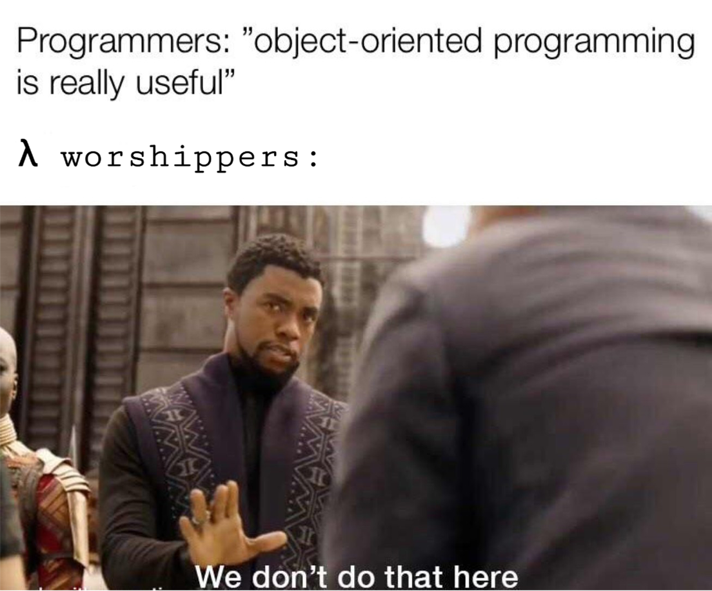

# **Functional JavaScript**

Daniel Němec

---

# Functional programming


---

# OOP ?



---

# Ideas

**If it compiles, it works**

- Declarative programming - what to do, not how to do
- Everything is function (no method, no class, etc.)
- Stateless functions
- Lazy evaluation (optimizations)
- Using Lamdba calculus
- `null`, `undefined`
- React is using functional ideas

---

# Is JavaScript functional language ?

JavaScript is not functional language, but for today we will have all examples in JavaScript.

---

# Immutable data - object

Mutating:

- `x.a = 3`

Returns new object:

- Object.assign
- Spread operator (`...`)

---

# Example

```js
const object = { name: 'John Doe', age: 13 };

object.age = 21; // obj: { name: "John Doe", age: 21 }
```

```js
const object = { name: 'John Doe', age: 13 };

const updatedObject = { ...obj, age: 21 };
```

---

# Immutable data - array

Mutating:

- `[1, 2].push(3)`

Returns new array:

- `[1, 2].concat([3])`
- Spred operator (`...`)

- `[].map(...)`, `[].filter(...)`, `[].reduce(...)`

---

# Example

```js
const numbers = [1, 2];

const updatedNumbers = [...numbers, 3];
```

---

# Pure functions


---

# Won't work in pure function

- API call
- Console.log
- Calling non-pure function - **Pure function can call ONLY pure function (implication, not equivalence)**
- Using global properties/configs
- Mutating input (you can use mutability for other properties used only in function body)

---

# Is it pure function ? #1

```js
const sum = (a, b) => a + b;
```

---

# Is it pure function ? #2

```js
const sumAdd3 = (a, b) => b + 3 + a;
```

---

# Is it pure function ? #3

```js
const x = 3;

const sum = (a, b) => b + a;
```

---

# Is it pure function ? #4

```js
const adultThreshold = 18;

const isAdult = ({ age }) => age >= adultThreshold;
```

---

# Is it pure function ? #5

```js
const sumWithLog = async (a, b) => {
  await fetch('http://example.com/api/log', {
    method: 'POST',
    headers: {
      Accept: 'application/json',
      'Content-Type': 'application/json',
    },
    body: JSON.stringify({ a, b }),
  });

  return a + b;
};
```

---

# Is it pure function ? #6

```js
const appendEmptyObject = (data) => [...data, {}];
```

---

# Is it pure function ? #7

```js
const appendEmptyObject = (data) => data.push({});
```

---

# Is it pure function ? #8

```js
const appendEmptyObject = (data) => {
  data = [...data, {}];

  return data;
};
```

---

# Is it pure function ? #9

```js
const getUserFromLocalStorage = () => {
  const user = localStorage.getItem('__logged-user__');

  return user;
};
```

---

# Is it pure function ? #10

```js
const getUserFromLocalStorage = (data) => {
  const user = localStorage.getItem('__logged-user__');

  return { ...user };
};
```

---

# Is it pure function ? #11

```js
const saveUserToLocalStorage = (user) => {
  localStorage.setItem('__logged-user__', user);

  return user;
};
```

---

# Is it pure function ? #12

```js
const isOlderThan = ({ age }, threshold) => age >= threshold;

const adultThreshold = 18;

const warningText = (user) => {
  if ((isOlderThan(user), adultThreshold)) {
    return '';
  } else {
    return 'You are too young!';
  }
};
```

---

# High-order function

- Function will return another function

```js
const sum = (arg1) => (arg2) => arg1 + arg2;

const sum5 = sum(5);
// sum5 = (arg2) => 5 + arg2

sum5(7) === sum(5)(7); // true

const sum_ = (arg1, arg2) => arg1 + arg2;

sum_(5, 7);
```

---

# map(), filter(), reduce()

```js
const data = [
  { id: 1, firstName: 'Luke', lastName: 'Skywalker', age: 30 },
  { id: 3, firstName: 'Darth', lastName: 'Vader', age: 50 },
  { id: 4, firstName: 'Obi-wan', lastName: 'Kenobi', age: 56 },
  { id: 5, firstName: 'Anakin', lastName: 'Skywalker', age: 13 },
];

const userMapper = ({ firstName, lastName, ...rest }) => ({
  name: [firstName, lastName].join(' '),
  ...rest,
});

const isAdult = ({ age }) => age >= 18;
```

---

# reduce() example

```js
data.reduce((accumulator, { age }) => accumulator + age, 0);
```

---

# map() example

```js
data.map(userMapper);

data.reduce(
  (accumulator, current) => [...accumulator, userMapper(current)],
  [],
);
```

---

# filter() example

```js
data.filter(isAdult);

data.reduce((accumulator, current) => {
  if (isAdult(current)) {
    return [...accumulator, current];
  } else {
    return accumulator;
  }
}, []);
```

---

# Domain as data

- In proggraming, biggest issue is complexity
- Data representations can reduce complexity by reducing the number of if statements
- Data has clear structure, limited access
- `[]`, `[{}]`, `[{}, {}, {}, ...]` - mostly interesting 3 options

---

# Summary

- Declarative, not imperative
- Immutable data
- Pure functions
- Easier to understand
- Model features as data
- Use functional patterns when working with JS and React!

---

# Questions ?

---

# Thank you for your attention!
